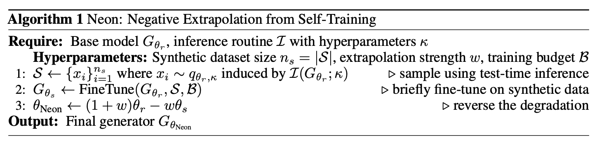

# Neon: Negative Extrapolation from Self‑Training

**Official repository for our paper *Neon: Negative Extrapolation from Self‑Training*.**


## Introduction

Scaling generative AI models is bottlenecked by the scarcity of high-quality training data. The ease of synthesizing from a generative model suggests using (unverified) synthetic data to augment a limited corpus of real data for the purpose of fine-tuning in the hope of improving performance. Unfortunately, however, the resulting positive feedback loop leads to model autophagy disorder (MAD, aka model collapse) that results in a rapid degradation in sample quality and/or diversity. In this paper, we introduce Neon (for Negative Extrapolation frOm self-traiNing), a new learning method that turns the degradation from self-training into a powerful signal for self-improvement. Given a base model, Neon first fine-tunes it on its own self-synthesized data but then, counterintuitively, reverses its gradient updates to extrapolate away from the degraded weights.  We prove that Neon works because typical inference samplers that favor high-probability regions create a predictable anti-alignment between the synthetic and real data population gradients, which negative extrapolation corrects to better align the model with the true data distribution. Neon is remarkably easy to implement via a simple post-hoc merge that requires no new real data, works effectively with as few as 1k synthetic samples, and typically uses less than 1% additional training compute.  We demonstrate Neon’s universality across a range of architectures (diffusion, flow matching, autoregressive, and inductive moment matching models) and datasets (ImageNet, CIFAR-10, and FFHQ). In particular, on ImageNet 256x256, Neon elevates the xAR-L model to a new state-of-the-art FID of 1.02 with only 0.36% additional training compute.

---

## Method



**In one line:** sample with your usual inference to form a synthetic set (S); briefly fine‑tune the reference model on (S) to get (	heta_s); then **reverse** that update with a merge (	heta_{	ext{neon}}=(1+w)	heta_r - w	heta_s) (small (w>0)), which cancels mode‑seeking drift and improves recall/FID.

---

## Benchmark Performance

| Model type    | Dataset          | Base model FID | Neon FID (paper) | Download model                                                                                          |
| ------------- | ---------------- | -------------: | ---------------: | ------------------------------------------------------------------------------------------------------- |
| xAR-L         | ImageNet-256     |           1.28 |         **1.02** | [Download](https://huggingface.co/sinaalemohammad/Neon/resolve/main/Neon_xARL_imagenet256.pth)          |
| xAR-B         | ImageNet-256     |           1.72 |         **1.31** | [Download](https://huggingface.co/sinaalemohammad/Neon/resolve/main/Neon_xARB_imagenet256.pth)          |
| VAR d16       | ImageNet-256     |           3.30 |         **2.01** | [Download](https://huggingface.co/sinaalemohammad/Neon/resolve/main/Neon_VARd16_imagenet256.pth)        |
| VAR d36       | ImageNet-512     |           2.63 |         **1.70** | [Download](https://huggingface.co/sinaalemohammad/Neon/resolve/main/Neon_VARd36_imagenet512.pth)        |
| EDM (cond.)   | CIFAR-10 (32×32) |           1.78 |         **1.38** | [Download](https://huggingface.co/sinaalemohammad/Neon/resolve/main/Neon_EDM_conditional_CIFAR10.pkl)   |
| EDM (uncond.) | CIFAR-10 (32×32) |           1.98 |         **1.38** | [Download](https://huggingface.co/sinaalemohammad/Neon/resolve/main/Neon_EDM_unconditional_CIFAR10.pkl) |
| EDM           | FFHQ-64×64       |           2.39 |         **1.12** | [Download](https://huggingface.co/sinaalemohammad/Neon/resolve/main/Neon_EDM_FFHQ.pkl)                  |
| IMM           | ImageNet-256     |           1.99 |         **1.46** | [Download](https://huggingface.co/sinaalemohammad/Neon/resolve/main/Neon_imm_imagenet256.pkl)           |

---

## 🚀 Quickstart

### 1) Environment

```bash
# from repo root
conda env create -f environment.yml
conda activate neon
```

### 2) Download pretrained models & FID stats

```bash
bash download_models.sh
```

This populates `checkpoints/` and `fid_stats/`.
**Pretrained Neon models can also be downloaded from Hugging Face:** [https://huggingface.co/sinaalemohammad/Neon](https://huggingface.co/sinaalemohammad/Neon)

### 3) Evaluate (FID/IS)

> All examples assume 8 GPUs; adjust `--nproc_per_node` / batch sizes as needed.

**xAR @ ImageNet‑256**

```bash
# 1) VAE for xAR (credit: MAR)
hf download xwen99/mar-vae-kl16 --include kl16.ckpt --local-dir xAR/pretrained
# 2) Use it via:
#   --vae_path xAR/pretrained/kl16.ckpt

# xAR‑L
PYTHONPATH=xAR torchrun --standalone --nproc_per_node=8 xAR/calculate_fid.py \
  --model xar_large \
  --model_ckpt checkpoints/Neon_xARL_imagenet256.pth \
  --cfg 2.3 --vae_path xAR/pretrained/kl16.ckpt \
  --num_images 50000 --batch_size 64 --flow_steps 40 --img_size 256 \
  --fid_stats fid_stats/adm_in256_stats.npz

# xAR‑B
PYTHONPATH=xAR torchrun --standalone --nproc_per_node=8 xAR/calculate_fid.py \
  --model xar_base \
  --model_ckpt checkpoints/Neon_xARB_imagenet256.pth \
  --cfg 2.7 --vae_path xAR/pretrained/kl16.ckpt \
  --num_images 50000 --batch_size 32 --flow_steps 50 --img_size 256 \
  --fid_stats fid_stats/adm_in256_stats.npz
```

**VAR @ ImageNet‑256 / 512**

```bash
# d16 @ 256
PYTHONPATH=VAR/VAR_imagenet_256 torchrun --standalone --nproc_per_node=8 \
  VAR/VAR_imagenet_256/calculate_fid.py \
  --var_ckpt checkpoints/Neon_VARd16_imagenet256.pth \
  --num_images 50000 --batch_size 64 --img_size 256 \
  --fid_stats fid_stats/adm_in256_stats.npz

# d36 @ 512
PYTHONPATH=VAR/VAR_imagenet_512 torchrun --standalone --nproc_per_node=8 \
  VAR/VAR_imagenet_512/calculate_fid.py \
  --var_ckpt checkpoints/Neon_VARd36_imagenet512.pth \
  --num_images 50000 --batch_size 32 --img_size 512 \
  --fid_stats fid_stats/adm_in512_stats.npz
```

**EDM (Karras et al.) @ CIFAR‑10 / FFHQ**

```bash
# CIFAR‑10 (conditional)
PYTHONPATH=edm torchrun --standalone --nproc_per_node=8 edm/calculate_fid.py \
  --network_pkl checkpoints/Neon_EDM_conditional_CIFAR10.pkl \
  --ref https://nvlabs-fi-cdn.nvidia.com/edm/fid-refs/cifar10-32x32.npz \
  --seeds 0-49999 --max_batch_size 256 --num_steps 18

# CIFAR‑10 (unconditional)
PYTHONPATH=edm torchrun --standalone --nproc_per_node=8 edm/calculate_fid.py \
  --network_pkl checkpoints/Neon_EDM_unconditional_CIFAR10.pkl \
  --ref https://nvlabs-fi-cdn.nvidia.com/edm/fid-refs/cifar10-32x32.npz \
  --seeds 0-49999 --max_batch_size 256 --num_steps 18

# FFHQ‑64 (unconditional)
PYTHONPATH=edm torchrun --standalone --nproc_per_node=8 edm/calculate_fid.py \
  --network_pkl checkpoints/Neon_EDM_FFHQ.pkl \
  --ref https://nvlabs-fi-cdn.nvidia.com/edm/fid-refs/ffhq-64x64.npz \
  --seeds 0-49999 --max_batch_size 256 --num_steps 40
```

**IMM @ ImageNet‑256**

```bash
# IMM @ T = 8
PYTHONPATH=imm torchrun --standalone --nproc_per_node=8 imm/calculate_fid.py \
  --model_ckpt checkpoints/Neon_IMM_imagenet256.pth \
  --num_images 50000 --batch_size 64 --img_size 256 \
  --fid_stats fid_stats/adm_in256_stats.npz
```

---

## 🧪 Toy Experiment (2D Gaussian)

A minimal, visual demo of Neon in action:

* File: `toy_appendix.ipynb`
* **What it does**: learns a 2D Gaussian with (i) a tiny diffusion model and (ii) a tiny autoregressive model, then applies Neon to show how the reverse‑merge restores coverage. Great for building intuition


---

## 🗺️ Repository Map

```
Neon/
├── VAR/                # VAR baselines + eval scripts
├── xAR/                # xAR baselines + eval scripts (uses MAR VAE)
├── edm/                # EDM baselines + metrics/scripts
├── imm/                # IMM baselines + eval scripts
├── toy_appendix.ipynb  # 2D Gaussian toy example (diffusion & AR)
├── download_models.sh  # Grab all checkpoints + FID refs
├── environment.yml     # Reproducible env
└── checkpoints/, fid_stats/ (created by the script)
```

---

## 📣 Citation

If you find Neon useful, please consider citing the paper:

```bibtex
@article{neon2025,
  title={Neon: Negative Extrapolation from Self-Training for Generative Models},
  author={Alemohammad, Sina and collaborators},
  journal={arXiv preprint},
  year={2025}
}
```

---

## Contact

Questions? Reach out to **Sina Alemohammad** — [sinaalemohammad@gmail.com](mailto:sinaalemohammad@gmail.com).

---

## Acknowledgments

This repository builds upon and thanks the following projects:

* [VAR — Visual AutoRegressive Modeling](https://github.com/FoundationVision/VAR)
* [xAR — Beyond Next‑Token: Next‑X Prediction](https://github.com/OliverRensu/xAR)
* [IMM — Inductive Moment Matching](https://github.com/lumalabs/imm)
* [EDM — Elucidating the Design Space of Diffusion Models](https://github.com/NVlabs/edm)
* [MAR VAE (KL‑16) tokenizer](https://huggingface.co/xwen99/mar-vae-kl16)
